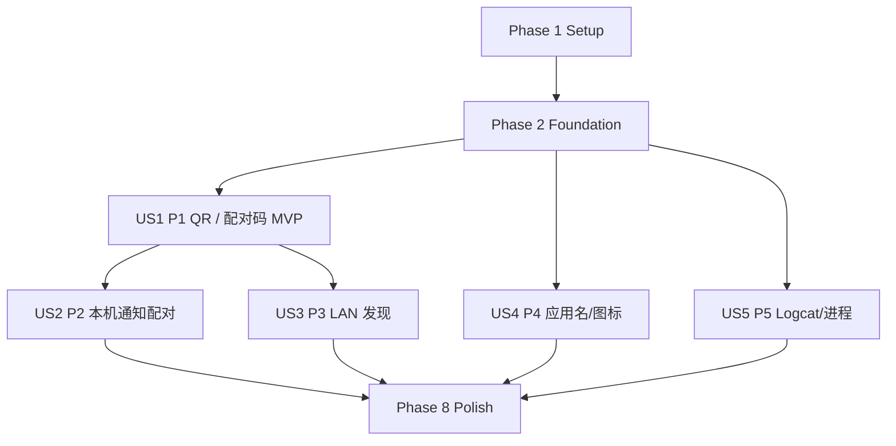

# Tasks: v0.04 无线发现与设备分析增强

**Input**: Design documents from `/specs/004-wireless-device-insights/`

**Prerequisites**: `plan.md`、`spec.md`、`research.md`、`data-model.md`、`contracts/`、`quickstart.md`

**TDD 规则**: 除依赖/文档登记、Manifest 平台声明和纯验证任务外，每个实现任务都依赖紧邻或明确列出的测试任务。测试任务必须先提交可编译的测试意图并确认因缺少目标行为而失败；实现任务只写使这些测试通过的最小代码。不得让测试因语法、错误 fixture 或真实敏感数据失败。

**文件边界**: 每个任务修改或创建的文件数为 0–2。任务描述中的文件路径就是该任务允许写入的全部范围；如发现必须触及第三个文件，应停止并拆出新任务，不得顺手扩大范围。

**验收边界**: 自动化通过、真机通过和发布合规分别记录。既有 `spake2-java 1.0.5` 许可证问题解决前，不得把功能或真机成功写成“可发布”。

## Format: `[ID] [P?] [Story] Description`

- **[P]**: 依赖满足后，可与同阶段其他 `[P]` 任务并行；不会修改相同文件。
- **[Story]**: 对应规格中的用户故事；Setup、Foundational 和 Polish 不带故事标记。
- 每个任务下一行的“验收”是该任务的独立完成标准。

---

## Phase 1: Setup（依赖与构建门禁）

**Purpose**: 在引入运行时代码前完成依赖治理，并准备最小 Gradle 接线。

- [X] T001 审查 ZXing core 3.5.4 与 apk-parser 2.6.10 的 POM、许可证、传递依赖、维护状态、恶意 ZIP 防护、Android API 30 运行时、替代和移除路径，并登记到 `docs/第三方依赖审查.md` 与 `docs/第三方依赖与许可证.md`
  - **验收**: 两份文档明确 ZXing 仅用于编码且无 scanner/camera 集成、apk-parser 上游已归档且为高风险门禁、可选传递依赖处理方式及既有 `spake2-java` 发布阻断；任一 apk-parser 门禁失败都将 US4 标为 BLOCKED 并返回 Plan 选择替代实现，不允许用整项 `UNSUPPORTED` 计为应用名/图标需求完成。
- [X] T002 在 `gradle/libs.versions.toml` 登记通过 T001 门禁的 `zxingCore`/`apkParser` alias，并在 `app/src/main/AndroidManifest.xml` 提前声明所有 NSD 故事共享的 `ACCESS_NETWORK_STATE` 与 `CHANGE_WIFI_MULTICAST_STATE`
  - **验收**: version catalog 可由 Gradle 解析且版本精确固定；merged Manifest 已包含两项权限且不包含位置、Nearby、相机或存储权限；apk-parser 仅在 T001 静态供应链门禁通过后登记，动态门禁通过前 US4 仍为 BLOCKED。
- [X] T003 [P] 将 ZXing core 以 implementation 方式接入 `feature/devices/build.gradle.kts`
  - **验收**: `:feature:devices:dependencies` 只出现 `com.google.zxing:core`，不出现 ZXing Android scanner、camera integration 或 JavaSE artifact，模块可完成 Debug Kotlin 编译。
- [X] T004 [P] 在 T001 静态供应链门禁通过后，将 APK parser 以隔离 implementation 方式接入并排除未批准可选依赖于 `core/adb/build.gradle.kts`
  - **验收**: `:core:adb:dependencies` 的运行时图与 T001 记录一致且不新增白名单外许可证；该接线只授权后续恶意 ZIP/API 30 验证，动态门禁实际通过前 US4 保持 BLOCKED，不能静默降级为仅包名交付。

**Checkpoint**: 新依赖均有可追溯审查；依赖门禁未通过时不会被构建脚本绕过。

---

## Phase 2: Foundational（所有故事的阻塞基础）

**Purpose**: 建立无线发现、配对生命周期、安全清理与 manager 边界；完成前不得开始任何用户故事实现。

- [X] T005 [P] 先写无线发现 reducer 的失败测试，覆盖两个 TLS service type、重复 observation 去重、可靠身份合并、未知身份分离、generation 迟到回调和 IPv4/IPv6 值对象于 `core/adb/src/test/kotlin/com/sheen/adb/core/internal/WirelessDiscoveryCoreTest.kt`
  - **验收**: `:core:adb:testDebugUnitTest --tests '*WirelessDiscoveryCoreTest'` 因缺少目标模型/reducer 或断言未满足而失败；测试不包含真实 IP、service name 或设备标识。
- [X] T006 实现不可变无线发现模型与 reducer 于 `core/adb/src/main/kotlin/com/sheen/adb/core/WirelessDiscoveryModels.kt` 和 `core/adb/src/main/kotlin/com/sheen/adb/core/internal/discovery/WirelessDiscoveryReducer.kt`
  - **验收**: T005 全部通过；只接受 `_adb-tls-pairing._tcp`/`_adb-tls-connect._tcp`，未知 pairing/connect 关系保持独立，旧 generation 结果不可进入当前状态。
- [X] T007 [P] 先写 NSD 策略/适配器失败测试，覆盖 API 30–32 MulticastLock、API 33+ 当前 Network、API 34+ 多地址、10 秒截止、stop 资源释放和禁止 `_adb._tcp` 于 `core/adb/src/test/kotlin/com/sheen/adb/core/internal/NsdDiscoveryAdapterTest.kt`
  - **验收**: 目标测试因策略/适配器尚未实现而失败；测试以 fake platform callback 验证，不访问真实网络。
- [X] T008 实现 API 分支策略与 Android NSD 平台适配于 `core/adb/src/main/kotlin/com/sheen/adb/core/internal/discovery/NsdDiscoveryPolicy.kt` 和 `core/adb/src/main/kotlin/com/sheen/adb/core/internal/discovery/AndroidNsdDiscoveryAdapter.kt`
  - **验收**: T007 通过；停止、取消、网络变化和异常均注销 callback、取消 resolve、释放 MulticastLock，且代码中不存在子网枚举或端口探测循环。
- [X] T009 [P] 先写配对生命周期失败测试，覆盖 QR/六位码状态、六位 ASCII 数字、过期/取消/失败终态、secret 清零、attempt token 和旧提交拒绝于 `core/adb/src/test/kotlin/com/sheen/adb/core/internal/PairingLifecycleTest.kt`
  - **验收**: 目标测试因模型/状态机缺失而失败；fixture 只使用合成凭据且断言终态内存不再暴露原值。
- [X] T010 实现配对值对象与状态机于 `core/adb/src/main/kotlin/com/sheen/adb/core/PairingModels.kt` 和 `core/adb/src/main/kotlin/com/sheen/adb/core/internal/pairing/PairingLifecycle.kt`
  - **验收**: T009 通过；所有终态幂等、不可回到活动态，六位码只接受 `0`–`9`，secret 在 `finally` 路径清零且不进入错误文本。
- [X] T011 [P] 先扩充敏感数据脱敏失败测试，覆盖 QR payload、非六位 QR password、NSD service name、IPv6/IPv4 端点和包名上下文于 `core/adb/src/test/kotlin/com/sheen/adb/core/DiagnosticRedactorTest.kt`
  - **验收**: 新断言在现有实现上失败，且测试仅使用合成值；现有配对码与端点脱敏测试保持通过。
- [X] T012 扩充诊断字段白名单与脱敏规则于 `core/adb/src/main/kotlin/com/sheen/adb/core/DiagnosticRedactor.kt`
  - **验收**: T011 与全部既有 redactor 测试通过；输出只含 stage/outcome/technicalCode 等安全字段，不含 QR、端点、service name、包名或原始异常正文。
- [X] T013 先写 manager 无线发现契约失败测试，覆盖 generation/session 归属、取消、覆盖 source create/start 的超时与取消传播、create 返回与取消竞争的 source 交接清理、source 启动同步拒绝与异步失败的结构化错误、关闭完成前的并发发现拒绝和关闭清理于 `core/adb/src/test/kotlin/com/sheen/adb/core/internal/WirelessSessionManagerContractTest.kt`
  - **验收**: 目标测试因 `AdbSessionManager` 无无线实现或实现不完整而失败；同步 `Rejected` 与异步 failure 均映射安全错误、阻塞 create/start 仍在有限超时内结束、`CancellationException` 不转成失败、create 即使在 interrupt 后返回 source 也必须被接管并关闭、旧 source 关闭完成前不启动新 source，且 source 只关闭一次；测试使用 fake adapter，不打开 Socket/NSD。
- [X] T014 扩展项目自有无线发现结果、结构化错误与 manager 契约于 `core/adb/src/main/kotlin/com/sheen/adb/core/AdbModels.kt` 和 `core/adb/src/main/kotlin/com/sheen/adb/core/AdbSessionManager.kt`
  - **验收**: T013 从“契约缺失”推进到仅因默认 manager 未实现而失败；新增 `AdbOperationStage.DISCOVERY`、不含端点/平台异常原文的结构化发现错误及项目自有 discovery source/coordinator 契约，公开 API 不暴露 `NsdManager`、`NsdServiceInfo`、Kadb、Socket 或原始命令。
- [X] T014A 将 discovery coordinator 接入默认 manager 于 `core/adb/src/main/kotlin/com/sheen/adb/core/internal/DefaultAdbSessionManager.kt`
  - **验收**: T013 及既有 manager 测试通过；同一时间只允许一个活动发现，所有结果带 generation/session guard，取消、超时、Session 变化、并发拒绝和 `close()` 均产生确定终态并清理 source。
- [X] T015 先写 Android discovery factory 失败测试，覆盖 application Context 注入、单例 manager、adapter close、不保存 Activity 引用、取消/中断传播、权限映射、网络变化终态和 callback/close 锁序于 `core/adb/src/test/kotlin/com/sheen/adb/core/internal/WirelessDiscoveryFactoryTest.kt`
  - **验收**: 目标测试因 provider 尚未装配 Android adapter 或平台生命周期不完整而失败；测试验证同一进程仍只有一个 manager，控制流异常不转成平台失败，close/callback 无锁反转且所有并发等待有界清理。
- [X] T016 将 Android NSD adapter 装配到唯一 manager 于 `core/adb/src/main/kotlin/com/sheen/adb/core/AdbManagerProvider.kt` 和 `core/adb/src/main/kotlin/com/sheen/adb/core/internal/discovery/AndroidNsdDiscoveryAdapter.kt`
  - **验收**: T015 与 `:core:adb:testDebugUnitTest` 全部通过；只持有 application Context，manager `close()` 可确定性释放 discovery 资源。
- [X] T016B 为异步 resolve 权限拒绝补充内部 failure 与资源终态于 `core/adb/src/main/kotlin/com/sheen/adb/core/internal/discovery/NsdDiscoveryPolicy.kt` 和 `core/adb/src/main/kotlin/com/sheen/adb/core/internal/discovery/AndroidNsdDiscoveryAdapter.kt`
  - **验收**: discovery 启动后 `resolve` 抛出的 `SecurityException` 不逃出 callback，单次映射为 `PERMISSION_UNAVAILABLE` 并释放全部 discovery/resolve/network/lock/timeout 资源；T015、T007、T013 与 `:core:adb:testDebugUnitTest` 全部通过。

**Checkpoint**: Foundation ready。无线发现与配对基础只存在于 `:core:adb`，Feature/App 只能消费项目自有类型。

---

## Phase 3: User Story 1 — 选择二维码或配对码完成无线配对（Priority: P1）🎯 MVP

**Goal**: 主控端可显示临时 QR 供被控端系统扫描，也可使用六位配对码；两条路径均有明确状态、安全清理和单 Session 确认。

**Independent Test**: 仅连接一台开启无线调试的被控设备，分别完成 QR 与六位码配对；验证不支持、错误、取消、过期、重复扫描和已有 Session，不依赖 LAN 列表、应用或诊断功能。

### Tests first

- [X] T017 [P] [US1] 先写 QR coordinator 失败测试，覆盖标准 payload、`SecureRandom` 注入、Android Studio 兼容的 `studio-` 加 10 字符实例名、12 字符 delimiter-safe password、2 分钟 TTL、精确 service instance 匹配、过期/重复扫描、首个明确结果获胜、结束清理和不自动连接于 `core/adb/src/test/kotlin/com/sheen/adb/core/internal/QrPairingCoordinatorTest.kt`
  - **验收**: 目标测试因 coordinator 缺失而失败；payload 断言为 `WIFI:T:ADB;S:<instance>;P:<password>;;`，固定 fake entropy 可复验长度、字符集和不可复用行为，fixture 不进入日志。
- [X] T018 [US1] 实现 QR pairing coordinator 于 `core/adb/src/main/kotlin/com/sheen/adb/core/internal/pairing/QrPairingCoordinator.kt`
  - **验收**: T017 通过；使用注入的加密安全随机源生成规定材料，只匹配仍有效且 instance 完全相同的 pairing service，结束后 QR payload/password/bitmap 引用失效，成功只表示已授权而未自动连接。
- [X] T019 [P] [US1] 先写 Kadb 与 manager QR 集成失败测试，覆盖任意长度 QR password、六位码共用 client path、超时/取消映射、`CharArray` 清零和已有 Session 不被替换于 `core/adb/src/test/kotlin/com/sheen/adb/core/internal/QrPairingSessionManagerTest.kt`
  - **验收**: 目标测试在现有 Kadb/manager 接线下失败；测试 fake 记录调用类别但不保留 secret 原文。
- [X] T020A [US1] 建立 manager QR 公共契约与已有 Session 冲突错误于 `core/adb/src/main/kotlin/com/sheen/adb/core/AdbModels.kt` 和 `core/adb/src/main/kotlin/com/sheen/adb/core/AdbSessionManager.kt`
  - **验收**: T019 从缺少公共入口的编译失败推进为行为失败；入口仅接受项目自有 `PairingSecret`/`PairingMethod`，默认兼容实现拒绝并清理 secret，结构化冲突不含端点或 secret，既有 manager fake 无需新增实现即可编译。
- [X] T020 [US1] 接入 QR/配对码共用 Kadb client path 于 `core/adb/src/main/kotlin/com/sheen/adb/core/internal/KadbProtocolClientFactory.kt` 和 `core/adb/src/main/kotlin/com/sheen/adb/core/internal/DefaultAdbSessionManager.kt`
  - **验收**: T019、既有配对码测试和 manager 回归通过；QR password 不被错误限制为六位，所有结束路径清零，配对不会创建第二个活动 Session。
- [X] T021 [P] [US1] 先写 QR matrix encoder 失败测试，覆盖 UTF-8 payload、固定 quiet zone/纠错配置、正方形矩阵、确定性输出和不提供 decode/camera API 于 `feature/devices/src/test/kotlin/com/sheen/adb/feature/devices/QrMatrixEncoderTest.kt`
  - **验收**: 目标测试因 encoder 缺失而失败；测试不把真实 QR 图像写入磁盘或 golden 文件。
- [X] T022 [US1] 实现隔离 ZXing 类型的 QR 编码器于 `feature/devices/src/main/kotlin/com/sheen/adb/feature/devices/QrMatrixEncoder.kt`
  - **验收**: T021 通过；公开 Feature 状态不暴露 ZXing 类型，不含扫码/相机入口，释放 pairing material 后不缓存旧矩阵。
- [X] T023 [P] [US1] 先写配对 reducer 失败测试，覆盖 QR/配对码选择、准备/等待/成功/失败/取消/过期、不支持回退、六位码立即清除和 Session 替换确认于 `feature/devices/src/test/kotlin/com/sheen/adb/feature/devices/DevicesPairingReducerTest.kt`
  - **验收**: 目标测试因 reducer/model 缺失而失败；每个规格状态均有独立断言，已有 Session 未确认时不得产生 connect effect。
- [X] T024 [US1] 实现设备配对 UI 状态与 reducer 于 `feature/devices/src/main/kotlin/com/sheen/adb/feature/devices/DevicesPairingModels.kt` 和 `feature/devices/src/main/kotlin/com/sheen/adb/feature/devices/DevicesPairingReducer.kt`
  - **验收**: T023 通过；状态不可保存 QR/secret 到 SavedState，错误区分 unsupported/expired/invalid/cancelled，code 提交 effect 使用可清零字符容器。
- [X] T024A [US1] 先写 manager-owned QR orchestration 失败测试，覆盖核心 material 失效、resolved observation 精确提交、取消/超时/旧 attempt、已有 Session 冲突和成功后不自动连接于 `core/adb/src/test/kotlin/com/sheen/adb/core/internal/QrPairingSessionManagerTest.kt`
  - **验收**: 目标测试因公共 QR material/manager orchestration 契约缺失而编译失败；fake 只记录调用类别与长度，不保留 payload、service name、endpoint 或 secret 原文。
- [X] T024B [US1] 建立核心可失效的只读 QR material 公共边界于 `core/adb/src/main/kotlin/com/sheen/adb/core/PairingModels.kt` 和 `core/adb/src/main/kotlin/com/sheen/adb/core/internal/pairing/QrPairingCoordinator.kt`
  - **验收**: 既有 T017 通过；feature 可读取 attemptId、deadline 与当前 payload，但不能读取 password/service instance，终态后同一 material 引用返回空 payload，公开类型不暴露 internal/Kadb/Socket。
- [X] T024C [US1] 扩展 manager-owned QR 创建、提交 observation 与取消契约于 `core/adb/src/main/kotlin/com/sheen/adb/core/AdbSessionManager.kt`
  - **验收**: T024A 从缺少 API 的编译失败推进为行为失败；默认兼容实现返回 `PairingUnsupported` 且不保留 material，既有 fake manager 无需实现新方法即可编译。
- [X] T024D [US1] 在唯一 manager 中持有 QR coordinator 并将已验证 observation 接入共用配对 path 于 `core/adb/src/main/kotlin/com/sheen/adb/core/internal/DefaultAdbSessionManager.kt`
  - **验收**: T024A、T017、T019 和全部 core manager 回归通过；只有当前 attempt 的精确 resolved pairing observation 可触发 Kadb，所有终态/close 清理 material，成功只授权且保持无连接状态，已有 Session 保持不变。
- [X] T024E [US1] 为 JVM ViewModel coroutine 测试登记同版本 test-only dispatcher 依赖于 `gradle/libs.versions.toml` 和 `feature/devices/build.gradle.kts`
  - **验收**: `kotlinx-coroutines-test` 与现有 Coroutines 版本一致且仅位于 test scope；dependency/compile 检查通过，运行时依赖、Manifest、权限和持久化均无变化。
- [X] T025 [US1] 先写 DevicesViewModel 配对流失败测试，覆盖 manager flow 收集、generation 丢弃、页面离开清理、重试和用户确认断开旧 Session 于 `feature/devices/src/test/kotlin/com/sheen/adb/feature/devices/DevicesPairingViewModelTest.kt`
  - **验收**: 目标测试因 ViewModel 未接入新 reducer/manager 而失败；fake manager/repository 不使用真实端点或包名。
- [X] T026 [US1] 将 QR 与配对码事件接入 ViewModel 于 `feature/devices/src/main/kotlin/com/sheen/adb/feature/devices/DevicesViewModel.kt`
  - **验收**: T025 与既有设备逻辑测试通过；取消、离页、断开、超时和 onCleared 均使旧 generation 无效并清除 pairing material，手动配对码入口仍可用。
- [X] T027 [US1] 先写配对展示策略失败测试，覆盖两种方式选择、QR 指引/隐私状态、配对码 fallback、所有终态文案和单 Session 确认对话框于 `feature/devices/src/test/kotlin/com/sheen/adb/feature/devices/DevicesPairingPresentationTest.kt`
  - **验收**: 目标测试因 presentation mapping 缺失而失败；文案明确“由被控端系统扫描”，不提示主控端相机。
- [X] T028 [US1] 实现配对 presentation mapping 与 Compose UI 于 `feature/devices/src/main/kotlin/com/sheen/adb/feature/devices/DevicesPairingPresentation.kt` 和 `feature/devices/src/main/kotlin/com/sheen/adb/feature/devices/DevicesScreen.kt`
  - **验收**: T027 与 `:feature:devices:testDebugUnitTest` 通过；QR、六位码、取消、重试、过期、不支持和 Session 替换确认均可操作，敏感值不进入 clipboard/语义描述/诊断。

**Checkpoint**: US1 可单独演示并作为 MVP 验收；不需要启用本机通知、LAN 列表、应用元数据或诊断增强。

---

## Phase 4: User Story 2 — 在本机模式通过通知快速输入配对码（Priority: P2）

**Goal**: 本机模式默认配对码，切换系统设置后由最长 2 分钟 short service 维持本机发现与隐私化通知输入，任何通知限制都可回退应用内输入。

**Independent Test**: 同一设备进入本机模式，覆盖端口发现、通知提交、锁屏、权限拒绝/关闭、OEM 不兼容、取消/失效/超时和应用内回退，不依赖其他 LAN 设备。

### Tests first

- [X] T029 [P] [US2] 先写核心本机通知决策失败测试，覆盖锁屏无 action、解锁后可输入、token/deadline、六位 ASCII 校验、权限/OEM 降级和所有停止条件于 `core/adb/src/test/kotlin/com/sheen/adb/core/internal/LocalPairingNotificationPolicyTest.kt`
  - **验收**: 目标测试因项目自有策略缺失而失败；断言锁屏前既不能输入也不能提交，输出只含平台无关决策且不含 code/endpoint/device identity。
- [X] T030 [US2] 实现平台无关的本机通知决策与窗口值对象于 `core/adb/src/main/kotlin/com/sheen/adb/core/internal/pairing/LocalPairingNotificationPolicy.kt` 和 `core/adb/src/main/kotlin/com/sheen/adb/core/PairingModels.kt`
  - **验收**: T029 通过；只有 unlocked + valid token + live endpoint + before deadline 才产生 input-ready 决策，拒绝路径明确指向应用内输入和原生通知样式建议，不引用 Android 通知类型。
- [X] T031 [P] [US2] 先写核心本机窗口 coordinator 失败测试，覆盖默认配对码、5 秒状态、2 分钟硬截止、service lost、Session change、通知提交与应用内提交共用路径于 `core/adb/src/test/kotlin/com/sheen/adb/core/internal/LocalPairingCoordinatorTest.kt`
  - **验收**: 目标测试因 coordinator 缺失而失败；使用 fake monotonic clock/manager，不真实等待，结束后无活动 discovery、token 或 secret。
- [X] T032A [US2] 扩展 manager-owned 本机配对 controller 公共契约与默认兼容实现于 `core/adb/src/main/kotlin/com/sheen/adb/core/AdbSessionManager.kt`
  - **验收**: T031 从缺少公共 controller API 推进为 coordinator 行为失败；公共类型不暴露 Android、internal、Kadb、Socket、原始端点或 secret，默认实现返回 `UNSUPPORTED`，既有 fake manager 无需修改即可编译。
- [X] T032 [US2] 实现本机配对窗口 coordinator 于 `core/adb/src/main/kotlin/com/sheen/adb/core/internal/pairing/LocalPairingCoordinator.kt` 和 `core/adb/src/main/kotlin/com/sheen/adb/core/internal/DefaultAdbSessionManager.kt`
  - **验收**: T031 与既有 manager 测试通过；唯一 manager 通过 T032A 公共 controller 暴露窗口，窗口不超过 2 分钟，所有终态在可测试的 3 秒预算内停止 discovery 并清理，且不启动 LAN/file/logcat 任务。
- [X] T033 [P] [US2] 先写 Android 平台桥失败测试，覆盖 Manifest 组件/权限、5 秒前台、API 34+ `onTimeout`、锁屏 action-free、动态 `ACTION_USER_PRESENT` 注册/注销、显式一次性 mutable PendingIntent、API 31+ `Notification.Action.Builder.setAuthenticationRequired(true)` 及接收端复检于 `app/src/test/kotlin/com/sheen/adbhelper/localpairing/LocalPairingPlatformContractTest.kt`
  - **验收**: 目标测试在 Service/Manifest 尚未实现时按行为断言失败；测试使用 fake Keyguard/notification facade，不依赖真实通知栏或 Activity 引用。
- [X] T034 [US2] 声明通知/前台服务权限与唯一非导出 shortService，并实现 Android Service/RemoteInput/解锁事件适配于 `app/src/main/AndroidManifest.xml` 和 `app/src/main/kotlin/com/sheen/adbhelper/localpairing/LocalPairingForegroundService.kt`
  - **验收**: T033 通过；merged Manifest 在 T002 两项 NSD 权限之外仅新增 `POST_NOTIFICATIONS`、`FOREGROUND_SERVICE` 和一个 `exported=false`、`shortService` 组件；Service 为 `START_NOT_STICKY`，只观察 core coordinator，窗口结束后注销 receiver、撤销通知并停止自身。
- [X] T035 [P] [US2] 先写 App 装配失败测试，覆盖 application Context、单 core coordinator、通知被清除、权限拒绝回调和进程重建不恢复旧窗口于 `app/src/test/kotlin/com/sheen/adbhelper/localpairing/LocalPairingAppBridgeTest.kt`
  - **验收**: 目标测试因 bridge/装配缺失而失败；测试证明 App 层只翻译平台事件，不复制 deadline/token/配对业务状态。
- [X] T036 [US2] 装配本机配对平台 bridge 与应用级生命周期于 `app/src/main/kotlin/com/sheen/adbhelper/localpairing/LocalPairingAppBridge.kt` 和 `app/src/main/kotlin/com/sheen/adbhelper/SheenApplication.kt`
  - **验收**: T035 通过；只持有 application Context，同一窗口只映射一个 core coordinator，进程结束不恢复旧窗口，通知权限拒绝不阻塞应用内流。
- [X] T037 [US2] 先扩充本机模式 Feature 失败测试，覆盖默认 code、local discovery 歧义、通知 waiting/input-unavailable、解锁后输入就绪、应用内重试、首次授权、OEM 建议和离页时仅活动 short-service 窗口例外于 `feature/devices/src/test/kotlin/com/sheen/adb/feature/devices/DevicesPairingReducerTest.kt`
  - **验收**: 新用例在 US1 reducer 上失败；多个候选时要求用户选择，权限提示仅由用户主动进入本机模式触发，所有 effect 只调用项目自有 core/App bridge。
- [X] T038 [US2] 扩展本机模式状态、事件与 reducer 于 `feature/devices/src/main/kotlin/com/sheen/adb/feature/devices/DevicesPairingModels.kt` 和 `feature/devices/src/main/kotlin/com/sheen/adb/feature/devices/DevicesPairingReducer.kt`
  - **验收**: T037 与既有 reducer 测试通过；本机入口默认六位码，found/not-found/ambiguous/unsupported、通知 waiting/input-unavailable、首次授权、OEM 建议和离页 short-service effect 均为项目自有状态。
- [X] T038A [US2] 将本机模式状态与公共 controller flow 接入 ViewModel 于 `feature/devices/src/main/kotlin/com/sheen/adb/feature/devices/DevicesViewModel.kt`
  - **验收**: T037、T025 与既有 ViewModel 回归通过；5 秒内交付核心发现状态，应用内输入始终存在且通知/应用提交共用 attemptId，旧 window/generation 结果无效。
- [X] T039A [US2] 扩充 bridge 测试并使 App bridge 幂等同步既有 controller window 的 short-service 生命周期于 `app/src/test/kotlin/com/sheen/adbhelper/localpairing/LocalPairingAppBridgeTest.kt` 和 `app/src/main/kotlin/com/sheen/adbhelper/localpairing/LocalPairingAppBridge.kt`
  - **验收**: 测试先因同步 API 缺失失败再转绿；既有活动 window 只启动一次 service，终态/无 window 只停止一次，不重复创建 controller window，进程重建不恢复旧窗口。
- [X] T039B [US2] 增加本机终态清理回归并修正 reducer 于 `feature/devices/src/test/kotlin/com/sheen/adb/feature/devices/DevicesPairingReducerTest.kt` 和 `feature/devices/src/main/kotlin/com/sheen/adb/feature/devices/DevicesPairingReducer.kt`
  - **验收**: 测试先证明本机成功/失败/取消/过期/不支持仍残留活动 window，再转绿；所有终态原子停止本机发现、关闭通知窗口且不会被随后普通离页覆盖。
- [X] T039 [US2] 将平台 bridge、系统设置入口、通知授权结果和本机状态接入 UI 于 `app/src/main/kotlin/com/sheen/adbhelper/SheenApp.kt` 和 `feature/devices/src/main/kotlin/com/sheen/adb/feature/devices/DevicesScreen.kt`
  - **验收**: T037、`:app:testDebugUnitTest` 与 `:feature:devices:testDebugUnitTest` 通过；通知拒绝/关闭/OEM 不兼容仍能从应用内提交，锁屏 UI/通知不泄漏敏感值，解锁后无需重启窗口即可继续输入，既有手动 localhost 入口保留。

**Checkpoint**: US2 可在单机上独立验收；普通 LAN、文件和诊断不会借 short service 延长后台生命周期。

---

## Phase 5: User Story 3 — 自动发现局域网无线调试设备（Priority: P3）

**Goal**: 用户前台进入发现页时看到系统公布的 ADB TLS 服务，可刷新/取消/选择，严格不扫描未公布主机或端口。

**Independent Test**: 受控 LAN 中放置已配对、待配对、重复、同名、离线和端口变化服务，验证 10 秒窗口、去重/保守关联、重新确认与手动回退；不依赖本机通知。

### Tests first

- [X] T040 [P] [US3] 先写 LAN manager 失败测试，覆盖前台 10 秒窗口、15 个服务、重复/丢失、网络切换、取消、后台停止、端点点击后重新确认、不自动 pair/connect，以及成功 TLS/ADB Session 后把同一主机公钥指纹生成的 opaque identity 同时回填 attempt 关联的 pairing observation 与最终 connect observation 于 `core/adb/src/test/kotlin/com/sheen/adb/core/internal/LanDiscoverySessionManagerTest.kt`
  - **验收**: 目标测试在 foundational manager 上因 LAN/identity 策略未完成而失败；fake adapter 记录的 service type 仅为两个 TLS 类型且无探测请求，只有同一 attempt 且指纹一致的 pairing/connect 条目合并，未连接或指纹不一致的条目保持独立。
- [X] T040A [US3] 定义带 generation/observation/attempt 归属的 discovered target、配对和连接公共契约于 `core/adb/src/main/kotlin/com/sheen/adb/core/WirelessDiscoveryModels.kt` 和 `core/adb/src/main/kotlin/com/sheen/adb/core/AdbSessionManager.kt`
  - **验收**: T040 从缺失 API 转为 manager 策略失败；默认实现对配对清除 secret 并结构化拒绝，Feature 无需也不能拼接发现 endpoint，既有 fake manager 继续编译。
- [X] T041 [US3] 完成 LAN discovery 生命周期、端点重新确认与 attempt 两端已验证 Session 身份回填于 `core/adb/src/main/kotlin/com/sheen/adb/core/internal/DefaultAdbSessionManager.kt` 和 `core/adb/src/main/kotlin/com/sheen/adb/core/internal/discovery/WirelessDiscoveryReducer.kt`
  - **验收**: T040、T005、T013 和全部既有 manager 测试通过；离页/后台/取消后 3 秒内停止，过期端点结构化失败，同一 attempt 的 pairing/connect observation 仅在已验证公钥指纹相同后合并，opaque identity 不进入日志/持久化且不自动替换 Session。
- [X] T042 [P] [US3] 先写设备发现 reducer 失败测试，覆盖 scanning/content/empty/error/cancelled、可靠合并、未知关系标记、lost/port-changed、手动回退和选择确认于 `feature/devices/src/test/kotlin/com/sheen/adb/feature/devices/DevicesDiscoveryReducerTest.kt`
  - **验收**: 目标测试因 discovery model/reducer 缺失而失败；同名/IP 相同不构成 verified merge。
- [X] T043 [US3] 实现设备发现 UI 模型与 reducer 于 `feature/devices/src/main/kotlin/com/sheen/adb/feature/devices/DevicesDiscoveryModels.kt` 和 `feature/devices/src/main/kotlin/com/sheen/adb/feature/devices/DevicesDiscoveryReducer.kt`
  - **验收**: T042 通过；每个条目显示 pairing/connect 角色、脱敏端点、可达性和未知关联提示，不保存真实结果到档案。
- [X] T044 [US3] 先写 DevicesViewModel LAN 流失败测试，覆盖 onForeground 自动扫描、refresh/cancel、onBackground stop、generation 丢弃、点击重新确认和已有 Session 确认于 `feature/devices/src/test/kotlin/com/sheen/adb/feature/devices/DevicesDiscoveryViewModelTest.kt`
  - **验收**: 目标测试因 ViewModel 未接入 discovery flow 而失败；fake flow 的旧结果不会出现在新 generation。
- [X] T045 [US3] 将 LAN discovery 事件接入 ViewModel 于 `feature/devices/src/main/kotlin/com/sheen/adb/feature/devices/DevicesViewModel.kt`
  - **验收**: T044 与 US1/US2 ViewModel 回归通过；前台进入自动开始，离页/后台/取消停止，选择 pairing 条目进入 US1，选择 connect 条目仍需用户确认。
- [X] T046 [US3] 先写发现列表展示策略失败测试，覆盖进度、空/受限原因、重复为零、未知关联、刷新/取消、过期目标和手动地址入口于 `feature/devices/src/test/kotlin/com/sheen/adb/feature/devices/DevicesDiscoveryPresentationTest.kt`
  - **验收**: 目标测试因 panel/presentation 缺失而失败；文案不承诺绕过 VPN、热点隔离或 ROM 策略。
- [X] T047 [US3] 实现 LAN discovery panel 并接入设备页于 `feature/devices/src/main/kotlin/com/sheen/adb/feature/devices/DevicesDiscoveryPanel.kt` 和 `feature/devices/src/main/kotlin/com/sheen/adb/feature/devices/DevicesScreen.kt`
  - **验收**: T046 与所有 devices tests 通过；15 条结果下 UI 可操作，刷新/取消/手动输入可见，应用后台不继续扫描且不存在端口扫描入口。

**Checkpoint**: US3 在受控网络中独立可测；没有任何未公布服务的主机收到主动探测。

---

## Phase 6: User Story 4 — 通过应用名、图标和包名管理应用（Priority: P4）

**Goal**: 保持当前用户第三方应用范围和既有操作语义，渐进补齐名称/图标，并按名称或包名搜索；无法可靠获取时明确降级。

**Independent Test**: 通过既有手动连接进入包含 200 个应用的设备，覆盖中文、同名、缺失/损坏/超大图标、split-only、取消和 Session 切换，不依赖无线发现或诊断增强。

### Tests first

- [X] T048 [P] [US4] 先写受限 APK parser 失败测试，使用内存合成 APK 覆盖 locale label、普通/自适应图标、缺资源、损坏 ZIP、zip traversal、压缩炸弹、split-only 和 32 MiB 上限于 `core/adb/src/test/kotlin/com/sheen/adb/core/internal/ApplicationMetadataParserTest.kt`
  - **验收**: 目标测试因 parser 接口/实现缺失而失败；fixture 在测试内生成，不含真实 APK、包名或签名材料，不写磁盘；至少一个 locale label 与普通/自适应图标成功用例必须通过实现满足，整项 `UNSUPPORTED` 不能让测试转绿。
- [X] T049 [US4] 实现隔离第三方类型的受限 APK 元数据 parser 于 `core/adb/src/main/kotlin/com/sheen/adb/core/internal/applications/ApplicationMetadataParser.kt`
  - **验收**: T048 通过并完成 API 30 Android runtime smoke test；public model 不暴露 apk-parser 类型，损坏/单包不支持结构化降级；T001 门禁失败时不得实施或把该故事标为完成，必须返回 Plan 选择替代 parser。
- [X] T050 [P] [US4] 先写 metadata loader 与有界 APK reader 失败测试，覆盖 `pm path --user` 来源路径、`ProtocolSyncStream.receive`、读取前后 32 MiB 上限、stream close、取消/超时/Session change、顺序读取、10 秒批次、1 MiB/16 MiB 图标上限、LRU 和单包失败不中断于 `core/adb/src/test/kotlin/com/sheen/adb/core/internal/ApplicationMetadataLoaderTest.kt`
  - **验收**: 目标测试因 reader/loader 缺失而失败；fake shell 只接受核心生成命令，fake Sync 证明成功/异常/取消均关闭，且无 cache/files/external storage 或公开 SAF 下载调用。
- [X] T050A [US4] 修正 metadata reader 取消测试的协程调度夹具于 `core/adb/src/test/kotlin/com/sheen/adb/core/internal/ApplicationMetadataLoaderTest.kt`
  - **验收**: 取消协程在独立 dispatcher 启动后才由测试线程等待 fake Sync 进入；用例不因 `runBlocking` 同线程饥饿而误报，仍证明取消关闭 stream。
- [X] T051 [US4] 实现内部有界 APK reader 与渐进 metadata loader 于 `core/adb/src/main/kotlin/com/sheen/adb/core/internal/applications/BoundedRemoteApkReader.kt` 和 `core/adb/src/main/kotlin/com/sheen/adb/core/internal/applications/ApplicationMetadataLoader.kt`
  - **验收**: T050 通过；只接受 PackageManager 解析路径并复用内部 Sync adapter，逐包处理且总预算 10 秒，超限立即停止接收，所有路径关闭 stream；取消/Session change 后不交付旧 update并释放 APK bytes/icon cache。
- [X] T052 [US4] 先写 manager metadata flow 失败测试，覆盖包列表先返回、逐项 update、`(sessionId,userId,packageName)` 归属、错误分类和既有应用操作不变于 `core/adb/src/test/kotlin/com/sheen/adb/core/internal/ApplicationMetadataSessionManagerTest.kt`
  - **验收**: 目标测试因 manager 尚无 metadata flow 而失败；既有 force-stop/enable/disable 测试仍保持绿色。
- [X] T053 [US4] 扩展应用展示模型与 manager metadata flow 于 `core/adb/src/main/kotlin/com/sheen/adb/core/AdbSessionManager.kt` 和 `core/adb/src/main/kotlin/com/sheen/adb/core/internal/DefaultAdbSessionManager.kt`
  - **验收**: T052 与现有 `ApplicationSessionManagerTest` 通过；包名首帧可用，单包失败不隐藏其他条目，断开/取消/切换后 update 作废。
- [X] T054 [US4] 先扩充 Apps 策略失败测试，覆盖 displayName/packageName OR 搜索、大小写/中文/数字/点/下划线、enabled filter 交集、同名包区分、占位和 Session 清理于 `feature/apps/src/test/kotlin/com/sheen/adb/feature/apps/AppsPolicyTest.kt`
  - **验收**: 新用例在现有包名-only 实现上失败；搜索预期不依赖元数据尚未加载的猜测名称。
- [X] T055 [US4] 接入渐进元数据、双字段搜索和 Session 清理于 `feature/apps/src/main/kotlin/com/sheen/adb/feature/apps/AppsModels.kt` 和 `feature/apps/src/main/kotlin/com/sheen/adb/feature/apps/AppsViewModel.kt`
  - **验收**: T054 和既有应用操作测试通过；元数据到达后 1 秒内更新匹配，包名始终正确，Session 变化清空名称、图标和搜索结果。
- [ ] T056 [US4] 先写应用条目 presentation 失败测试，覆盖名称优先/包名 fallback、统一占位、同名包名、metadata 状态、超长/双向文本和图标 1 MiB 拒绝于 `feature/apps/src/test/kotlin/com/sheen/adb/feature/apps/AppsPresentationTest.kt`
  - **验收**: 目标测试因 icon renderer/presentation 缺失而失败；测试仅使用合成像素与包名。
- [ ] T057 [US4] 实现受限图标 renderer 与应用列表展示于 `feature/apps/src/main/kotlin/com/sheen/adb/feature/apps/ApplicationIconRenderer.kt` 和 `feature/apps/src/main/kotlin/com/sheen/adb/feature/apps/AppsScreen.kt`
  - **验收**: T056 与 `:feature:apps:testDebugUnitTest` 通过；列表在缺失/损坏/超大图标时使用统一占位，同名始终显示包名，既有操作确认仍绑定当前 Session + packageName。

**Checkpoint**: US4 可通过既有手动连接独立验收；不安装远端 helper、不请求存储权限、不持久化 APK 或图标。

---

## Phase 7: User Story 5 — 使用 Logcat 与进程分析定位问题（Priority: P5）

**Goal**: 在当前有界、前台、用户启动的诊断流中提供结构化 Logcat、可靠进程/应用关联和 AND 组合筛选，不增加高级诊断或控制能力。

**Independent Test**: 通过既有手动连接，用合成 threadtime 日志和只读进程快照验证所有单项/组合筛选、PID 复用、多进程、字段缺失、进程退出、停止/断开和导出；不依赖无线或应用图标功能。

### Tests first

- [ ] T058 [P] [US5] 先写 Logcat parser/filter 失败测试，覆盖 threadtime 字段、UNPARSED/STDERR、level/tag/keyword/PID/process/app、非空条件 AND、10k/4MiB 淘汰和最新 100 条于 `core/adb/src/test/kotlin/com/sheen/adb/core/internal/LogcatAnalysisTest.kt`
  - **验收**: 目标测试因 parser/filter 缺失而失败；合成日志不含真实应用/设备信息，未知格式保留 raw text 且不伪造 PID/level/tag。
- [ ] T059 [US5] 实现 structured Logcat parser 与组合 filter 于 `core/adb/src/main/kotlin/com/sheen/adb/core/internal/diagnostics/StructuredLogcatParser.kt` 和 `core/adb/src/main/kotlin/com/sheen/adb/core/internal/diagnostics/DiagnosticFilter.kt`
  - **验收**: T058 通过；所有启用条件取交集，UNKNOWN/MULTIPLE association 不作为唯一应用命中，过滤不扩大原始缓冲。
- [ ] T060 [P] [US5] 先写应用 UID 命令与 Session 集成失败测试，覆盖 `pm list packages -3 -U --user` 输出、UID 缺失降级、当前用户范围和既有应用操作回归于 `core/adb/src/test/kotlin/com/sheen/adb/core/internal/ApplicationCapabilitiesTest.kt` 和 `core/adb/src/test/kotlin/com/sheen/adb/core/internal/ApplicationSessionManagerTest.kt`
  - **验收**: 新断言因命令尚未请求/解析 UID 而失败，现有 fixture 更新为合成 UID 且不含真实包名；测试继续证明只枚举当前用户第三方应用并保持 force-stop/enable/disable 语义。
- [ ] T061 [US5] 扩展应用清单 UID 命令/解析与项目自有关联模型于 `core/adb/src/main/kotlin/com/sheen/adb/core/internal/ApplicationCapabilities.kt` 和 `core/adb/src/main/kotlin/com/sheen/adb/core/AdbModels.kt`
  - **验收**: T060 中命令、解析和 UID 归一化断言通过，既有应用管理测试同步保持当前用户第三方范围；UID 缺失显式保留 unknown，不记录包名上下文且不新增进程终止能力。
- [ ] T062 [US5] 先写进程关联与 manager 诊断集成失败测试，覆盖 Android UID 归一化为 `(userId,appId)`、Session/snapshot generation、PID 复用、共享 UID、多用户、多进程、字段缺失、进程退出、VERIFIED/MULTIPLE/UNKNOWN、structured stream、停止/取消/断开/Session change 和旧结果拒绝于 `core/adb/src/test/kotlin/com/sheen/adb/core/internal/ProcessAssociationTest.kt` 和 `core/adb/src/test/kotlin/com/sheen/adb/core/internal/DiagnosticsSessionManagerTest.kt`
  - **验收**: 目标测试因 association/manager 集成缺失而失败；任何共享 UID、多用户冲突或不确定关系均为 MULTIPLE/UNKNOWN，禁止按 PID/进程名前缀猜测，现有 raw copy/export 语义保持可验证。
- [ ] T063 [US5] 实现可靠进程关联并接入 structured Logcat/关联快照于 `core/adb/src/main/kotlin/com/sheen/adb/core/internal/diagnostics/ProcessAssociation.kt` 和 `core/adb/src/main/kotlin/com/sheen/adb/core/internal/DefaultAdbSessionManager.kt`
  - **验收**: T060、T062、现有 streamLogcat/listProcesses 与全部 core tests 通过；只有同 Session/代次且归一化 UID 唯一匹配时为 VERIFIED，离页/停止/断开/Session change 不交付旧记录，解析错误明确降级。
- [ ] T064 [P] [US5] 先写进程筛选 Feature 失败测试，覆盖完整/部分 PID、进程名、应用、AND 语义、空/退出/不支持、UNKNOWN/MULTIPLE 和 Session 清理于 `feature/processes/src/test/kotlin/com/sheen/adb/feature/processes/ProcessesAnalysisPolicyTest.kt`
  - **验收**: 目标测试在现有 name/PID-only 实现上失败；只读快照不产生 kill/force-stop effect。
- [ ] T065 [US5] 实现进程分析状态、筛选和 Compose 展示于 `feature/processes/src/main/kotlin/com/sheen/adb/feature/processes/ProcessesViewModel.kt` 和 `feature/processes/src/main/kotlin/com/sheen/adb/feature/processes/ProcessesScreen.kt`
  - **验收**: T064 与 `:feature:processes:testDebugUnitTest` 通过；结果区分 empty/exited/unsupported/cancelled/disconnected，筛选 1 秒内更新且没有进程控制入口。
- [ ] T066 [P] [US5] 先写 Logcat window Feature 失败测试，覆盖结构化记录、全部筛选、AND、pause/resume/clear、10k/4MiB、100 可见、generation 和当前可见导出于 `feature/logcat/src/test/kotlin/com/sheen/adb/feature/logcat/LogcatAnalysisWindowTest.kt`
  - **验收**: 目标测试在现有 keyword-only window 上失败；导出断言只含当前可见匹配内容，未知关联不误归属。
- [ ] T067 [US5] 扩展有界 window 与 ViewModel 分析状态于 `feature/logcat/src/main/kotlin/com/sheen/adb/feature/logcat/LogcatBuffer.kt` 和 `feature/logcat/src/main/kotlin/com/sheen/adb/feature/logcat/LogcatViewModel.kt`
  - **验收**: T066、既有 `LogcatBufferTest` 和导出回归通过；过滤变化不重读无界历史，停止/离页/Session change 清除关联并拒绝旧流。
- [ ] T068 [US5] 先写 Logcat presentation 失败测试，覆盖 level/tag/keyword/PID/process/app 控件、组合条件摘要、空/截断/解析失败/停止状态和复制/导出确认于 `feature/logcat/src/test/kotlin/com/sheen/adb/feature/logcat/LogcatPresentationTest.kt`
  - **验收**: 目标测试因新展示策略缺失而失败；文案不包含真实 package/log 内容，不出现 crash/ANR/资源趋势等越界入口。
- [ ] T069 [US5] 实现 Logcat 基础分析 Compose UI 于 `feature/logcat/src/main/kotlin/com/sheen/adb/feature/logcat/LogcatScreen.kt`
  - **验收**: T068 与全部 logcat tests 通过；各筛选可单独/组合清除，1 秒内更新有界结果，复制/SAF 导出仍需用户明确动作且只使用当前可见内容。

**Checkpoint**: US5 可独立验收；维持前台采集、只读进程、有界内存和现有导出边界。

---

## Phase 8: Polish & Cross-Cutting Concerns

**Purpose**: 在所有目标故事完成后同步当前事实、权限、依赖与验证证据；不在此阶段补写未测试的新功能。

- [ ] T070 [P] 更新无线配对、发现和单 Session 当前架构事实于 `docs/architecture/adb-session.md` 和 `docs/architecture/device-and-data.md`
  - **验收**: 文档只描述已由代码/测试证明的行为，链接到项目自有接口与 ADR 0007；未完成真机项明确标为待验，不把 Plan 当实现事实。
- [ ] T071 [P] 更新应用元数据与基础诊断当前架构事实于 `docs/architecture/application-management.md` 和 `docs/architecture/diagnostics.md`
  - **验收**: 文档准确记录容量、Session、降级、筛选与关联边界，不声明高级诊断或持久化图标/日志。
- [ ] T072 同步最终 Manifest 状态和隐私说明于 `docs/权限矩阵.md` 和 `docs/privacy-policy.md`
  - **验收**: “待实现声明”只在 merged Manifest 证据通过后改为“已声明”；隐私说明覆盖本地 NSD、通知输入、应用元数据与诊断且不暗示上传。
- [ ] T073 复核实际解析图、许可证/NOTICE、维护风险、体积和移除路径于 `docs/第三方依赖审查.md` 和 `docs/第三方依赖与许可证.md`
  - **验收**: 文档与 Gradle 实际解析结果一致；ZXing/apk-parser 与传递依赖无遗漏，`spake2-java` 阻断仍存在时明确保留发布 BLOCKED。
- [ ] T074 按 `specs/004-wireless-device-insights/quickstart.md` 运行全量单元测试、lint、Debug assemble、merged Manifest 与断链/敏感值扫描，并记录实际输出于 `docs/archive/releases/v0.04/verification.md`
  - **验收**: 设置 `JAVA_HOME=C:\Users\Richard\.gradle\sheen-jdk21` 后命令结果、失败项和未运行项均逐项记录；不得把自动化通过写成真机通过。
- [ ] T075 按固定协议执行 40 次配对成功率验证（QR/配对码各 20 次，至少覆盖 Android 11、13、16）并记录于 `docs/archive/releases/v0.04/verification.md`
  - **验收**: 从用户点击到明确结果统一计时，分别给出成功次数、成功率、P95、30 秒超时和脱敏失败分类；SC001、SC004、SC010、SC011、SC013 可追溯，未执行项保持 `NOT_RUN`。
- [ ] T076 按固定协议执行 20 次本机启动、20 次通知到达及 20 轮各 15 服务 LAN 发现，并记录于 `docs/archive/releases/v0.04/verification.md`
  - **验收**: SC002/SC003/SC005 分别给出成功次数、成功率、P95 与失败分类；覆盖 Android 11–16、至少两种 OEM 通知样式、锁屏到解锁无需重启窗口、IPv4/IPv6 和网络切换，真实端点/service name 均脱敏。
- [ ] T077 使用固定脚本组织至少 10 名首次用户各完成一次 QR 与一次配对码任务，并记录聚合可用性证据于 `docs/archive/releases/v0.04/usability.md`
  - **验收**: 记录样本数、无需主持人纠正且 2 分钟内完成的人数/比例和脱敏阻塞点；达到或未达到 SC012 均如实报告，不记录参与者身份、配对码或真实设备信息。
- [ ] T078 在隔离网络用数据包捕获或 sentinel 监听执行 20 轮 LAN discovery，并记录无主动探测证据于 `docs/archive/releases/v0.04/network-observation.md`
  - **验收**: 明确区分 DNS-SD/mDNS 查询、已公布服务解析、用户选择后连接与禁止流量；只有证明未出现子网枚举或未公布主机/端口探测时 SC016 才通过，缺少捕获环境则标 `BLOCKED`。
- [ ] T079 按 200 应用与诊断受控数据集执行应用/进程/Logcat 真机矩阵，并更新 `docs/archive/releases/v0.04/verification.md`
  - **验收**: 记录中英文/同名/缺失图标、名称与包名查询 1 秒内更新、PID 复用/共享 UID/多进程、10k/4MiB/100 条边界和 Session 切换；SC007–SC009、SC014、SC017 逐项追溯且无真实包名或 Logcat 入库。
- [ ] T080 分别评估功能完成、自动化、真机、可用性、网络观察和发布合规，并记录门禁于 `docs/archive/releases/v0.04/release-gates.md`
  - **验收**: 六类结论互不替代；任何缺失证据保持 `NOT_RUN`/`BLOCKED`，只要 ADR 0004 的 `spake2-java` 条件未关闭，发布状态必须为 BLOCKED，且不创建虚假的发布完成结论。

---

## Dependencies & Execution Order

### Phase dependencies



- **Phase 1**: 无前置依赖；T001 是 T002–T004 的依赖门禁。
- **Phase 2**: 依赖 Phase 1；阻塞所有用户故事。
- **US1**: 依赖 Foundation，是无线入口 MVP。
- **US2**: 依赖 US1 的配对状态机/Kadb path；本机通知行为可独立验收。
- **US3**: discovery core 来自 Foundation，但完整“选择后进入 QR/配对码”依赖 US1。
- **US4 / US5**: 仅依赖 Foundation 和既有手动连接，可与 US1–US3 并行实施。
- **Phase 8**: 依赖本次准备交付的全部故事；T074 后按可用环境执行 T075–T079，T080 依赖 T073–T079。

### Within-task TDD dependencies

- T005 → T006；T007 → T008；T009 → T010；T011 → T012；T013 → T014 → T014A → T015 → T016。
- US1：T017 → T018 → T019 → T020A → T020；T021 → T022；T023 → T024 → T024A → T024B → T024C → T024D → T024E → T025 → T026；T027 → T028。
- US2：T029 → T030；T031 → T032A → T032；T033 → T034；T035 → T036；T037 → T038 → T038A → T039A → T039B → T039。
- US3：T040 → T040A → T041；T042 → T043 → T044 → T045；T046 → T047。
- US4：T048 → T049；T050 → T051 → T052 → T053；T054 → T055；T056 → T057。
- US5：T058 → T059；T060 → T061 → T062 → T063；T064 → T065；T066 → T067；T068 → T069。

### Requirements traceability

| Requirement range | Primary tasks |
|---|---|
| FR-001–FR-007（两种配对、材料清理、单 Session） | T009–T010、T017–T028 |
| FR-008–FR-015（本机发现、通知、锁屏、2 分钟服务） | T029–T039 |
| FR-016–FR-022（LAN NSD、去重、前台生命周期、隐私） | T005–T008、T013–T016（含 T014A）、T040–T047 |
| FR-023–FR-029（应用名、图标、搜索、Session） | T048–T057 |
| FR-030–FR-036、FR-042（Logcat/进程基础分析） | T058–T069 |
| FR-037–FR-041（通用取消/超时、纯本地、权限、回归） | T011–T016（含 T014A）、T029–T039、T070–T080 |

| Success criteria | Primary tasks |
|---|---|
| SC001（40 次配对成功率/30 秒） | T017–T028、T075 |
| SC002–SC004（本机 5 秒、通知 3 秒与降级） | T029–T039、T076 |
| SC005–SC006（15 服务 LAN 发现与手动回退） | T040–T047、T076、T078 |
| SC007–SC009（200 应用、双字段搜索、可靠关联） | T048–T069、T079 |
| SC010–SC011、SC013（取消清理、敏感数据与回归） | T011–T016（含 T014A）、T074–T075 |
| SC012（至少 10 名首次用户） | T077 |
| SC014（诊断筛选与边界） | T058–T069、T079 |
| SC015（本机后台例外边界） | T029–T039、T076 |
| SC016（无主动探测网络证据） | T007–T008、T040–T047、T078 |
| SC017（仅可靠身份合并） | T005–T006、T040–T047、T079 |
| SC018（解锁后继续输入） | T029–T039、T076 |

### Parallel opportunities

- Phase 1：T003 与 T004 在 T002 后并行；共享 NSD 权限已由 T002 提前提供给 US1/US3。
- Foundation：T005、T007、T009、T011 可先并行写失败测试；对应实现修改不同文件，可在各自测试验收后并行。
- Foundation 完成后，US4 与 US5 可直接并行；US1 按 P1 优先推进，完成后 US2/US3 可并行。
- 每个故事内仅 `[P]` 测试任务可在其依赖满足后并行；任何共同修改 `DefaultAdbSessionManager.kt`、`DevicesViewModel.kt`、`DevicesScreen.kt` 或 `AdbModels.kt` 的实现任务必须按编号串行。
- Polish：T070 与 T071 可并行；T075–T079 修改不同证据文件时可按环境并行，但同改 `verification.md` 的 T075/T076/T079 必须串行；T080 最后执行。

## Parallel Execution Examples

### US1

```text
并行启动 T017（QR coordinator 测试）、T021（QR encoder 测试）、T023（配对 reducer 测试）。
各测试确认预期失败后，T018、T022、T024 可分别在 core/feature 的不同文件上并行；manager client 接线先由 T020A 建立公共契约，再由 T020 完成协议实现。ViewModel 接线前由 T024A 固定 manager-owned orchestration 契约，随后顺序完成 T024B、T024C、T024D；这些任务均等待 T018/T019/T024。
```

### US2

```text
并行启动 T029（core 通知决策测试）、T031（core 本机窗口测试）、T033（Android 平台桥测试）和 T035（App 装配测试）。
对应实现 T030/T032/T034/T036 分别转绿后，再执行 T037→T038→T038A→T039A→T039B→T039 的 Feature/UI 接线。
```

### US3

```text
并行启动 T040（core LAN 生命周期测试）、T042（Feature reducer 测试）和 T046（展示策略测试）。
T041 与 T043 修改不同模块可并行；ViewModel/Screen 接线 T045、T047 按编号执行。
```

### US4

```text
并行启动 T048（APK parser 测试）、T050（loader 测试）、T054（搜索策略测试）、T056（展示测试）。
parser/loader 按 T049→T051→T053 串行收敛 core contract；Feature 的 T055/T057 在 manager contract 稳定后执行。
```

### US5

```text
并行启动 T058（Logcat parser/filter 测试）、T060（关联测试）、T064（进程 Feature 测试）、T066（Logcat window 测试）。
core 中涉及 AdbModels/manager 的 T061/T063 串行；process 与 logcat Feature 实现修改不同模块，可在 core contract 完成后并行。
```

---

## Implementation Strategy

### MVP first

1. 完成 T001–T016（含新增的 T014A；Setup + Foundation，包括 US1/US3 共用 NSD 权限）。
2. 完成 T017–T028（US1）。
3. 停止并按 US1 Independent Test 单独验证 QR 与六位码。
4. 未获项目负责人批准前不进入 Implement；Tasks 获批后仍逐任务执行 TDD 与文件上限。

### Incremental delivery

1. **MVP**: Foundation + US1，提供两种配对入口。
2. **Local increment**: US2，增加本机通知与 2 分钟窗口。
3. **Discovery increment**: US3，增加前台 NSD LAN 列表。
4. **Usability increment**: US4，增加名称/图标/双字段搜索。
5. **Diagnostics increment**: US5，增加结构化筛选和可靠关联。
6. 每个增量都先运行自己的独立测试，再运行已完成故事回归；最后执行 Phase 8。

## Notes

- `[P]` 只表示文件与未完成依赖允许并行，不表示可以跳过测试先行。
- 每项任务最多修改 2 个文件；发现第三文件需求时必须新增任务并重新编号依赖。
- 测试、文档和证据只能使用合成/脱敏端点、service name、包名和日志。
- 不使用真实等待测试 2 分钟/10 秒窗口；以 fake monotonic clock/dispatcher 验证，再由真机矩阵验证平台行为。
- 任务清单不授权自动提交、推送、发布、安装远端 helper、扩大权限或引入未审查依赖。
